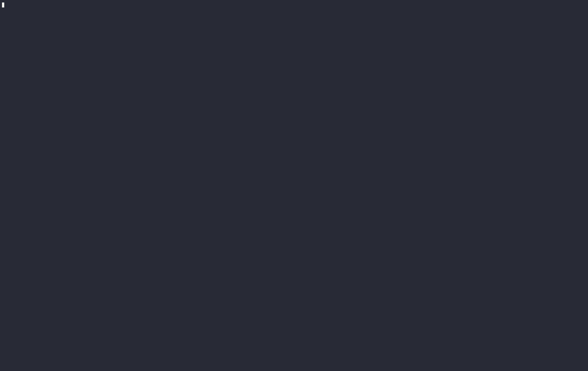

# kubectl-kedify plugin

Simple TUI based shell script for installing and interfacing with Kedify.


[](https://asciinema.org/a/668253)
([pauseable demo](https://asciinema.org/a/668253))

## Commands

### Core Commands

- **install, i** - Installs the Kedify agent
- **delete, d** - Uninstalls the Kedify agent
- **status, s** - Prints the status of Kedify agent
- **logs, l** - Prints the logs of Kedify agent
- **autoscale, a** - Runs the interactive mode for creating HTTPScaledObject

### Debug & Analysis Commands

- **debug, dbg** - Provides low-level information regarding Kedify components
  - `so/scaledobject` - Inspect ScaledObject resource
  - `httpaddon` - Verify HTTP Addon setup and current configuration

- **insights, ins** - Analyzes ScaledObjects for potential configuration issues
  - Checks for polling interval effectiveness when minReplicaCount > 0
  - Identifies low polling interval values that might overload services  
  - Detects missing fallback configuration for supported scalers

- **dump, dmp** - Collects comprehensive debug information from Kedify/KEDA components
  - Gathers cluster-wide information (nodes, autoscaler data, etc.)
  - Collects namespace-specific data (events, scaling resources, pod logs)
  - Supports output to directory or compressed archive format

## Quick start

Having krew [installed](https://krew.sigs.k8s.io/docs/user-guide/setup/install/), just run:

```bash
kubectl krew install --manifest-url=https://github.com/kedify/kubectl-kedify/raw/main/.krew.yaml
```

```bash
# output:
Installing plugin: kedify
Installed plugin: kedify
\
 | Use this plugin:
 | 	kubectl kedify
 | Documentation:
 | 	https://github.com/kedify/kubectl-kedify
/
```
### Usage

```bash
k kedify --version
```

### Update

```
kubectl kedify -v
kubectl krew uninstall kedify && kubectl krew install --manifest-url=https://github.com/kedify/kubectl-kedify/raw/main/.krew.yaml
kubectl kedify -v
```

### Requirements

This plugin requires couple of binaries to work properly. `kubecolor` is optional, but recommended.

Mac:
```bash
brew install bat curl figlet fzf kubecolor yq jq
```

Linux:

```bash
yum install bat curl figlet fzf jq
```

or

```bash
apt-get install bat curl figlet fzf jq
```

and for `yq` consult the [readme](https://github.com/mikefarah/yq#install).

## Running Dump Script Standalone

The dump command can also be run as a standalone script directly from GitHub without installing the kubectl plugin. This is useful for quick diagnostics or in environments where kubectl plugins cannot be installed.

### Usage

```bash
# Download and run the dump script directly
bash <(curl -s https://raw.githubusercontent.com/kedify/kubectl-kedify/refs/heads/main/dump.sh) [options]

# Examples:
bash <(curl -s https://raw.githubusercontent.com/kedify/kubectl-kedify/refs/heads/main/dump.sh) -A --archive
bash <(curl -s https://raw.githubusercontent.com/kedify/kubectl-kedify/refs/heads/main/dump.sh) -A --archive -o /tmp/debug --quiet
```

### Standalone Options

All the same options available in the kubectl plugin are supported:

- `-o, --output DIR` - Output directory or archive file path
- `-n, --namespace NS` - Specific namespace (default: current namespace)  
- `-A, --all-namespaces` - Collect from all namespaces
- `-q, --quiet` - Quiet mode - suppress all status output for cleaner automation
- `--archive` - Create tar.gz archive

### Requirements for Standalone Usage

The standalone script requires the same dependencies as the plugin:
- `kubectl` (configured with cluster access)
- `curl`, `jq`, `yq` 
- `tar` and `gzip` (for archive mode)

## Development and Testing

### Local Testing

This project includes a cross-platform test script that automatically detects and validates all bash scripts.

```bash
# Run default tests (full on Mac/Linux, smoke on others)
./test-cross-platform.sh

# Run smoke tests only (basic syntax, function loading - works on all platforms)
./test-cross-platform.sh smoke

# Run full tests (includes shellcheck, platform-specific features - Mac/Linux only)
./test-cross-platform.sh full
```

### Running as kubectl plugin vs locally

The script automatically detects whether it's running as a kubectl plugin (via krew) or locally in development:

- **As kubectl plugin**: Uses scripts from the krew store (`~/.krew/store/kedify/`)
- **Locally**: Uses scripts from the project directory

This allows for seamless development and testing of unreleased features.
